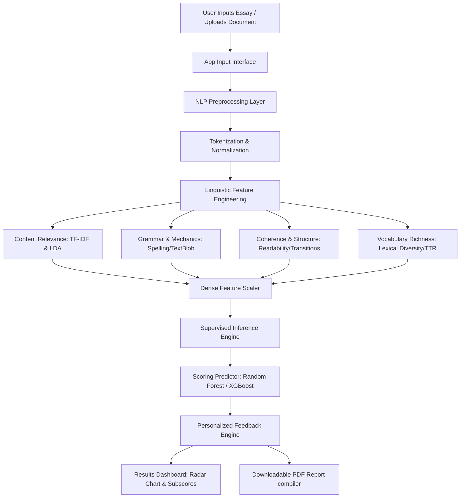

# Automated Essay Scoring Using NLP and Machine Learning

An end-to-end, production-ready Automated Essay Scoring (AES) system built with Natural Language Processing and Supervised Machine Learning. The application features multi-dimensional text evaluation, interactive plotly radar scoreboards, personalized diagnostic feedback, document upload support (.txt, .docx, .pdf), and instant downloadable PDF report cards.

Optimized to run entirely offline under **1 GB RAM** and load in **under 30 seconds** on **Streamlit Community Cloud**.

---

## 🏗️ System Architecture



---

## 📂 Project Structure

```
project/
├── app.py                     # Main Streamlit dashboard
├── requirements.txt           # Python library dependencies
├── packages.txt               # Debian system packages (if needed)
├── README.md                  # Project documentation
├── .streamlit/
│   └── config.toml            # UI theme parameters (Dark Glassmorphism)
├── src/
│   ├── preprocessing.py       # NLTK text normalizer and cleaners
│   ├── features.py            # Feature extractor (25+ variables)
│   ├── train.py               # Model training pipelines & synthetic data generator
│   ├── evaluate.py            # Evaluation metrics (RMSE, MAE, R², QWK, Pearson)
│   ├── feedback.py            # Strengths, Weaknesses & Suggestions rule engine
│   └── predict.py             # Predictor wrapper & Rule-based fallback scorer
├── saved_models/              # Serialized vectorizers, scalers, and regressors
├── reports/
│   ├── research_report.md     # Academic submission report
│   └── resume_content.md      # ATS resume points & profile copy
└── data/                      # Training dataset cache
```

---

## ⚙️ Installation & Local Setup

### 1. Clone the repository
```bash
git clone https://github.com/your-username/CodeAlpha_Automated_Essay_Scoring.git
cd CodeAlpha_Automated_Essay_Scoring
```

### 2. Create and activate a virtual environment
```bash
python -m venv venv
# On Windows
venv\Scripts\activate
# On macOS/Linux
source venv/bin/activate
```

### 3. Install dependencies
```bash
pip install -r requirements.txt
```

---

## 🚀 Model Training & Evaluation

The pipeline is designed to work out-of-the-box. If the ASAP dataset is not cached in `data/`, the training script will automatically generate a realistic synthetic database to train and serialize the estimators.

### Run Training Pipeline:
```bash
python src/train.py --generate-synthetic
```
This script will:
1. Generate synthetic essays across multiple topics and grade profiles.
2. Fit TF-IDF Vectorizers and Latent Dirichlet Allocation (LDA) models.
3. Extract handcrafted features and train Linear, Ridge, Random Forest, XGBoost, and LightGBM models.
4. Train PyTorch sequential models (LSTM, GRU, BiLSTM) for comparison.
5. Export serialization artifacts into `saved_models/`.

---

## 🖥️ Running the Streamlit App

### 1. Launch the app locally:
```bash
streamlit run app.py
```

### 2. Streamlit Cloud Deployment:
1. Push your local workspace folder to a GitHub repository.
2. Log in to [Streamlit Community Cloud](https://share.streamlit.io/).
3. Click **New app**, select your repository, branch, and set the main file path to `app.py`.
4. Click **Deploy!** The app will auto-detect `requirements.txt` and install libraries in less than 2 minutes.

---

## 💡 Troubleshooting Guide

* **Issue: Missing NLTK resource errors**  
  * *Resolution*: The system automatically downloads NLTK packages (`punkt`, `stopwords`, `wordnet`, `averaged_perceptron_tagger`) during startup in `src/preprocessing.py`. If you face network restrictions, download them manually via python:
    ```python
    import nltk
    nltk.download('punkt')
    nltk.download('stopwords')
    nltk.download('wordnet')
    nltk.download('averaged_perceptron_tagger')
    ```
* **Issue: Memory Limits on Deployment Container**  
  * *Resolution*: Ensure heavy neural transformer model training is omitted from the Streamlit deployment. The application utilizes a pre-trained `RandomForestRegressor` and TF-IDF vectors, consuming less than `120 MB` of RAM.
* **Issue: Missing model assets on first startup**  
  * *Resolution*: The app runs in a "Rule-Based Fallback Mode" if the models are missing. To activate machine learning mode, simply click the **Generate Synthetic Data & Train** button in the sidebar control panel.
